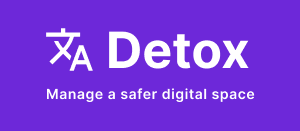

    

## Inspiration

Today, there are approximately 4.66 billion people using the internet. 4.66 billion thinking, feeling, emotional humans spread across the entire world, speaking different languages. Humans can be hurt by toxic content. We, Nishka, Swathi, Siddesh and Arumugam, believe that **nobody** should have their day ruined by an offensive message, by an inappropriate text, or by a hurtful comment.

## What it does

Our solution to the increasing toxicity of the internet is easy to integrate web service that offers toxicity filtering to any web-based platform. We trained a multilingual model to classify and filter toxic content in your messages or webpages.

## How we built it

We wanted Detox to be universal and independent of language, and so, we decided to train a multilingual model which would be able to filter hate speech and toxic content. To achieve this, we used the XLM-Roberta model as a starting point and fine-tuned it to perform excellently on toxicity classification across languages. We created an API endpoint for the model and deployed it in an ec2 instance. To handle high traffic, we attached a load balancer to the instance which would scale based on the traffic.

Finally, to demonstrate the application of detox we built a couple of sample applications.

1. A discord bot that deletes hurtful messages and warns users about them.
2. An android accessibility service that overlays a screen containing offensive content with a warning message.

## Challenges we ran into

Deploying the model in an AWS EC2 instance required a lot of manual configurations and a lot of time was spent to handle the high traffic volume.
Additionally, we had limited experience in Android development but learnt a lot in the process of developing a custom accessibility service from scratch to suit our needs.

## Accomplishments that we're proud of

We were overjoyed when we tested the web service for the first time as it was able to effectively classify toxic and hurtful content. Additionally, our fine-tuned model reported a training accuracy of 96.55% and a validation accuracy of 87.78%.
We were also able to successfully deploy this model with AWS and integrate it to filter out toxicity on two very different platforms - discord and android phones.

## What we learned

We were able to develop a wide range of skills among us throughout the course of this project- from Android development with Java to the creation of Discord bots with Python. We also learnt how to deploy our deep learning model to a cloud platform, AWS, to make it easier to integrate with new services across a number of platforms.

## What's next for Detox

We plan to build a chrome extension that censors hateful content. We also plan to allow users to report false negatives and false positives. We can then use this data to continue scaling our model.
